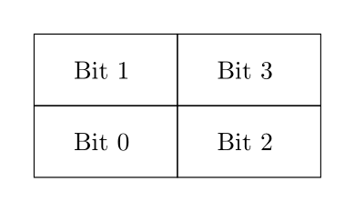

Table of contents

{: .text-delta}
1. TOC
{:toc}

## Test 1 practice papers

Two practice papers are available below; the actual test will be similar in form and content. Note that these papers don't have any questions on transistors, but transistors *are* examinable.

* [Practice paper A: theory part](https://www.ole.bris.ac.uk/ultra/courses/_264263_1/outline) (located under "Practice in-class tests", model answers available on submission - just click OK)
* [Practice paper A: practical part](../practice/paper_1a/practical_paper.pdf) ([skeleton file](../practice/paper_1a/skeleton.circ), [model answers](../practice/paper_1a/solutions.circ))
* [Practice paper B: theory part](https://www.ole.bris.ac.uk/ultra/courses/_264263_1/outline) (located under "Practice in-class tests", model answers available on submission - just click OK)
* [Practice paper B: practical part](../practice/paper_1b/practical_paper.pdf) ([skeleton file](../practice/paper_1b/skeleton.circ), [model answers](../practice/paper_1a/solutions.circ))

## Test 1 practice questions

We also encourage you to go back over the weekly Blackboard quizzes (for the theory part), and the weekly assignments (for the practical part). Some additional practice practical questions are below, with a skeleton file available [here](../practice/test_1_skeleton.circ) and solutions available [here](../practice/test_1_solutions.circ). These questions are further from the exam than the practice papers above, but still practice the same skills the exam will require.

* * *

**Question 1:** Create a circuit that implements the Boolean expression:

(A ∨ (B ∧ ¬C) ) ∧ ((¬B ∧ ¬B) ∨ (B ∧ ¬C))

Permitted components: 2-input AND gates, 2-input OR gates, and NOT gates.

* * *

**Question 2:** Create a circuit that implements a multiplexer with 1-bit inputs A, B, and Sel, and a 1-bit output Out. When Sel is 0, Out should output the value of A. When Sel is 1, Out should output the value of B.

Permitted components: 2-input AND gates, 2-input OR gates, and NOT gates.

* * *

**Question 3:** Create a circuit that implements the below truth table, using at most 9 logic gates. Partial credit will be given for any solution that implements the truth table with more than 9 gates, depending on the number of gates used.

| A | B | C | D | Out |
|:--|:--|:--|:--|:----|
| 0 | 0 | 0 | 0 | 0   |
| 0 | 0 | 0 | 1 | 1   |
| 0 | 0 | 1 | 0 | 1   |
| 0 | 0 | 1 | 1 | 0   |
| 0 | 1 | 0 | 0 | 1   |
| 0 | 1 | 0 | 1 | 1   |
| 0 | 1 | 1 | 0 | 1   |
| 0 | 1 | 1 | 1 | 0   |
| 1 | 0 | 0 | 0 | 0   |
| 1 | 0 | 0 | 1 | 1   |
| 1 | 0 | 1 | 0 | 1   |
| 1 | 0 | 1 | 1 | 0   |
| 1 | 1 | 0 | 0 | 0   |
| 1 | 1 | 0 | 1 | 1   |
| 1 | 1 | 1 | 0 | 1   |
| 1 | 1 | 1 | 1 | 0   |

Permitted components: Any logic gates with 2 or fewer inputs.

* * *

**Question 4:** Create a circuit that implements the below Boolean expression, using at most 7 logic gates. Partial credit will be given for any solution that implements the truth table with more than 7 gates, depending on the number of gates used.

(¬A ∧ ¬C) ∨ ((C ∨ ¬A) ∧ (B ∨ C) ∧ (D ∨ ¬A) ∧ (B ∨ D))

Permitted components: Any logic gates with 2 or fewer inputs.

* * *

**Question 5:** Create a circuit that implements a one-shot with 1-bit input In and 1-bit output Out. When In is high on a falling clock edge, Out should be high for one complete clock cycle. Out should then transition to low and remain low until In is low on a falling clock edge and then is high again on a falling clock edge.

Permitted components: Any logic gates with 2 or fewer inputs, any flip-flops, registers.

* * *

**Question 6:** Create a circuit that implements the Hack ALU with 4-bit inputs X and Y, 1-bit inputs ZX, NX, ZY, NY, F, and NO, and a 4-bit output Out. Given the below values of ZX, NX, ZY, NY, F, and NO listed below, Out should be set to the corresponding output (scroll right):

| ZX | NX | ZY | NY | F | NO | Out |
|:--:|:--:|:--:|:--:|:-:|:--:|:---:|
| 1  | 0  | 1  | 0  | 1 | 0  | 0   |
| 1  | 1  | 1  | 1  | 1 | 1  | 1   |
| 1  | 1  | 1  | 0  | 1 | 0  | 1   |
| 0  | 0  | 1  | 1  | 0 | 0  | X   |
| 1  | 1  | 0  | 0  | 0 | 0  | Y   |
| 0  | 0  | 1  | 1  | 0 | 1  | !X  |
| 1  | 1  | 0  | 0  | 0 | 1  | !Y  |
| 0  | 0  | 1  | 1  | 1 | 1  | -X  |
| 1  | 1  | 0  | 0  | 1 | 1  | -Y  |
| 0  | 1  | 1  | 1  | 1 | 1  | X+1 |
| 1  | 1  | 0  | 1  | 1 | 1  | Y+1 |
| 0  | 0  | 1  | 1  | 1 | 0  | X-1 |
| 1  | 1  | 0  | 0  | 1 | 0  | Y-1 |
| 0  | 0  | 0  | 0  | 1 | 0  | X+Y |
| 0  | 1  | 0  | 0  | 1 | 1  | X-Y |
| 0  | 0  | 0  | 1  | 1 | 1  | Y-X |
| 0  | 0  | 0  | 0  | 0 | 0  | X&Y |
| 0  | 1  | 0  | 1  | 0 | 1  | X\|Y|

Permitted components: Any logic gates with 2 or fewer inputs, multiplexers, demultiplexers, adders.

* * *

**Question 7:** Create a circuit with 1-bit inputs Up, Down, Left, and Right, and a 4-bit output Pos. Pos should represent the position of an item in a 2x2 grid, using one-hot encoding.  The bit of Pos that represents each position on the grid is shown below. For example, if the item is in the bottom left of the grid then Pos should be 0001.

If Up, Down, Left, or Right are high on a rising clock edge, Pos should be updated accordingly (you may assume only one of these inputs will be high at a time). For example, if Pos starts as 0001 and Right is high on the next rising edge, then Pos should immediately be updated to 0100. If Right is still high on the next rising edge, then Pos should remain as 0100, as the item has reached the rightmost edge of the grid.

Permitted components: All components are permitted.

* * *

**Question 8:** Create a circuit that controls a timer LED, with 1-bit inputs Start/Stop, Reset, and Snooze, a 4-bit input In, and a 4-bit output Out. The timer LED should only be on when Out is exactly 0000.

While Reset is 1: On a rising clock edge, Out should be set to the value of In.

While Snooze is 1: On a rising clock edge, if the timer LED is on, then Out should be set to 0101. You may assume that Reset and Snooze will not be high at the same time.

While Start/Stop is 1: On a rising clock edge, if Reset is low, then the value of Out should decrement by 1. When Out reaches 0000, it should stay at that value.

Permitted components: All components are permitted.
